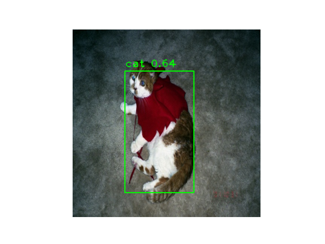

# EfficientDet - Tensorflow 2 


Custom implementation of [EfficientDet](https://arxiv.org/abs/1911.09070) using 
tensorflow 2.



## Table of contents

- [Installation 💿](#Installation)
- [Training The model 🧠](#training-the-model)
- [Evaluate a model ✅](#evaluate-a-model)
- [Using a trained model 🎯](#using-a-trained-model)

## Installation

Just run `pip install`.

```
$pip install git+https://github.com/Guillem96/efficientdet-tf
```

## Training the model

Currently this EfficientDet implementation supports training with 2 data formats:

- **labelme format**. This format corresponds to the [labelme](https://github.com/wkentaro/labelme)
annotations outputs. See a training example [here](https://github.com/Guillem96/efficientdet-tf/blob/master/examples/Train_EfficientDet_with_Labelme_Dataset.ipynb) 🔥🔥. 

- **VOC2007 format**. The format corresponds to the one described [here](http://host.robots.ox.ac.uk/pascal/VOC/voc2007/).

You can specify the data model on the training command.
Also you can efficiently train your model on VOC2007 with the VOC command of 
the `efficientdet.train` script as follows:

```bash
$ python efficientdet.train <efficientdet and train params> VOC
```

Refer to this [script](scripts/train.sh) to see a training job example.

### Training With Command Line Interface (CLI)

```
$ python -m efficientdet.train --help
Usage: train.py [OPTIONS] COMMAND [ARGS]...

Options:
  --efficientdet INTEGER          EfficientDet architecture. {0, 1, 2, 3, 4,
                                  5, 6, 7}
  --bidirectional / --no-bidirectional
                                  If bidirectional is set to false the NN will
                                  behave as a "normal" retinanet, otherwise as
                                  EfficientDet
  --freeze-backbone / --no-freeze-backbone
                                  Wether or not freeze EfficientNet backbone
  --print-freq INTEGER            Print training loss every n steps
  --validate-freq INTEGER         Print COCO evaluations every n epochs
  --epochs INTEGER                Number of epochs to train the model
  --batch-size INTEGER            Dataset batch size
  --learning-rate FLOAT           Optimizer learning rate. It is recommended
                                  to reduce it in case backbone is not frozen
  --w-scheduler / --wo-scheduler  With learning rate scheduler or not. If left
                                  to true, --learning-rate option will act as
                                  max lr for the scheduler
  --alpha FLOAT                   Proportion to reduce the learning rate
                                  during the decay period
  --checkpoint PATH               Path to model checkpoint
  --from-pretrained TEXT          Path or reference to pretrained model. For
                                  example if you want to train a model from a
                                  VOC pretrained checkpoint, use the value
                                  --from-pretrained D0-VOC
  --save-dir DIRECTORY            Directory to save model weights  [required]
  --help                          Show this message and exit.

Commands:
  VOC
  labelme
```

### Train the model with labelme format

The command below is the one that we should use if we want to train the model with
the data coming from [here](https://github.com/Guillem96/efficientdet-tf/tree/master/test/data/pokemon).

```
$ python -m efficientdet.train \
  --efficientdet 0 \
  --learning-rate 1e-2 \
  --save-dir models/pokemon \ 
  labelme \
  --train-dataset test/data/pokemon/ \
  --images-path test/data/pokemon/ \
  --classes-file test/data/pokemon/classes.names 
```

## Evaluate a model

```
$ python -m efficientdet.eval --help

Usage: eval.py [OPTIONS]

Options:
  --format [VOC|labelme]          Dataset to use for training  [required]
  --test-dataset DIRECTORY        Path to annotations and images  [required]
  --images-path DIRECTORY         Base path to images. Required when using
                                  labelme format  [required]
  --checkpoint PATH               Path to model checkpoint  [required]
  --help                          Show this message and exit.
```

## Using a trained model

```python
import tensorflow as tf
import efficientdet

effdet = efficientdet.EfficientDet.from_pretrained('...')

im_size = model.config.input_size
images  = tf.random.uniform((3, *im_size, 3)) # 3 Mock images

boxes, labels, scores = effdet(images, training=False)

# labels -> List of tf.Tensor of shape [N,]
# boxes -> List of tf.Tensor of shape [N, 4]
# scores -> Confidence of each box
for im_boxes, im_labels in zip(boxes, labels):
    # Process boxes of a specific image
    ...
```

For more on how to use pretrained model see the inference example [here](examples/EfficientDet_TF_Example.ipynb) 📝.

### Pretrained weights


How to use pretrained models:

1. Choose your favorite badge. For example: 
2. Load the model referencing the badge (use the white and blue text) as shown below.

```python
from efficientdet import EfficientDet

badge_name = 'D0-VOC'
# With pretrained classification head
model = EfficientDet.from_pretrained(badge_name)

# With custom head
# Note: This will initialize a random classifier head, so it requires
# fine tuning
model = EfficientDet.from_pretrained(chckp_path, 
                                     num_classes=<your_n_classes>)
```

Transfer learning using the CLI.

```bash
$ python -m efficientdet.train *usual-parameters* \
  --from-pretrained <badge_reference> # For example, D0-VOC
```

This will automatically append a custom classification head to a pretrained model, and start training.


## Roadmap

The road map is ordered by priority. Depending on my feelings this can go up and down, so don't take it as something that will be done immediately.

- [x] Migrate anchors code to Tensorflow
- [x] Define as many tf.functions as possible (Now the training is 7 times faster than without `tf.function`)
- [ ] Define COCO input pipeline using `tf.data`
- [ ] Distribute training over multiple GPUs
- [x] Learning rate schedulers to speed up and enhance training
- [x] Proper evaluation using COCO mAP
- [ ] Reproduce similar paper results
- [x] Visualization utils
- [ ] Define a custom data-format to train with own datasets
- [x] Data augmentation pipelines

## References

[1] [Focal Loss for Dense Object Detection - Tsung-Yi Lin Priya Goyal Ross Girshick Kaiming He Piotr Dollár](https://arxiv.org/abs/1708.02002)

[2] [EfficientDet: Scalable and Efficient Object Detection - {tanmingxing, rpang, qvl}@google.com](https://arxiv.org/abs/1911.09070)

[3] [Keras Retinanet](https://github.com/fizyr/keras-retinanet/)

